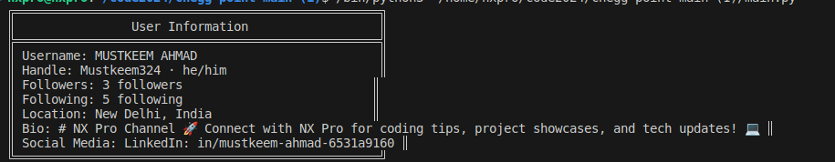

# Welcome to My GitHub Profile 🌟


[](https://twitter.com/Mustkee54967794)

---
```
def display_user_info(username, handle, followers, following, location, bio, social_media):
    print("╔══════════════════════════════════════════════════╗")
    print("║                User Information                  ║")
    print("╠══════════════════════════════════════════════════╣")
    print("║ Username: {:<38} ║".format(username))
    print("║ Handle: {:<40} ║".format(handle))
    print("║ Followers: {:<36} ║".format(followers))
    print("║ Following: {:<36} ║".format(following))
    print("║ Location: {:<37} ║".format(location))
    print("║ Bio: {:<41} ║".format(bio))
    print("║ Social Media: {:<32} ║".format(social_media))
    print("╚══════════════════════════════════════════════════╝")

# information
username = "MUSTKEEM AHMAD"
handle = "Mustkeem324 · he/him"
followers = "3 followers"
following = "5 following"
location = "New Delhi, India"
bio = "# NX Pro Channel 🚀 Connect with NX Pro for coding tips 💻"
social_media = "LinkedIn: in/mustkeem-ahmad-6531a9160"

# Display my github information
display_user_info(username, handle, followers, following, location, bio, social_media)

```
---
### Output



---
## 🎨 About Me

Greetings, fellow coder! 🖥️ I'm Mustkeem Ahmad, a relentless creator hailing from New Delhi. My journey through the digital realm is marked by a profound passion for Developer. With every keystroke, I strive to craft elegant solutions and push the boundaries of innovation.

---
### Skills


<p align="left">
<a href="https://developer.mozilla.org/en-US/docs/Web/JavaScript" target="_blank" rel="noreferrer"></a><a href="https://www.python.org/" target="_blank" rel="noreferrer"></a><a href="https://developer.mozilla.org/en-US/docs/Glossary/HTML5" target="_blank" rel="noreferrer"></a><a href="https://www.w3.org/TR/CSS/#css" target="_blank" rel="noreferrer"></a><a href="https://getbootstrap.com/" target="_blank" rel="noreferrer"></a><a href="https://jquery.com/" target="_blank" rel="noreferrer"></a><a href="https://reactjs.org/" target="_blank" rel="noreferrer"></a><a href="https://nodejs.org/en/" target="_blank" rel="noreferrer"></a><a href="https://expressjs.com/" target="_blank" rel="noreferrer"></a><a href="https://www.mongodb.com/" target="_blank" rel="noreferrer"></a><a href="https://www.mysql.com/" target="_blank" rel="noreferrer"></a><a href="https://flask.palletsprojects.com/en/2.0.x/" target="_blank" rel="noreferrer"></a>
</p>

---
## 🚀 What Awaits You Here?

Prepare to embark on a thrilling voyage through a constellation of creativity, innovation, and code wizardry. Nestled within these repositories are gems of my imagination, ranging from whimsical experiments to robust applications. So, loosen your digital moorings and let's set sail!

---

## 🌟 Project Highlights

### [Project Name]

Unleash the power of Devloper, a marvel of modern ingenuity designed to [Project's Mission]. With its sleek interface and robust functionality, it's poised to revolutionize [Relevant Industry/Field]. Join the revolution and be a part of something extraordinary!

Demo: [[Link]](https://github.com/Mustkeem324)

Repository: [[Link to the project repository]](https://github.com/Mustkeem324)


---

## 🤝 Collaboration Corner

Seeking kindred spirits to embark on collaborative quests and breathe life into daring ideas. Whether you're a seasoned developer or a starry-eyed enthusiast, there's a place for you in the annals of our shared creations. Join me in sculpting tomorrow's digital landscape, one commit at a time.

---

## 📝 Contribution Guidelines

Venture forth into the realm of collaboration armed with courage, curiosity, and a dash of code. Should you stumble upon a bug, envision a feature, or simply wish to sprinkle some magic dust on existing projects, heed these guidelines:

1. Fork the repository.
2. Create a new branch (`git checkout -b feature/your-feature`).
3. Work your magic and make your changes.
4. Commit your sorcery with meaningful messages (`git commit -m 'Add magic feature'`).
5. Push your changes to your branch (`git push origin feature/your-feature`).
6. Summon the spirits of collaboration by submitting a pull request.

---
### Badges

<b>My GitHub Stats</b>

<a href="http://www.github.com/Mustkeem324"></a>

<a href="http://www.github.com/Mustkeem324-ul"></a>

<a href="https://github.com/Mustkeem324" align="left"></a>

---
## 📬 Let's Connect

Eager to exchange tales of triumph, share snippets of wisdom, or simply indulge in some digital banter? Don't hesitate to reach out through any of the following portals:

- Email: mustkeem324@gmail.com
- LinkedIn: https://www.linkedin.com/in/mustkeem-ahmad-6531a9160/
- Telegram: [My Telegram Channel](https://t.me/cheggnx)

Join my Telegram channel for exclusive updates, behind-the-scenes insights, and lively discussions on all things tech and creativity. Let's build a vibrant community together! 🚀


[](https://t.me/cheggnx)

Together, let's script the next chapter of innovation and leave an indelible mark on the tapestry of technology. Onward, to infinity and beyond! 🚀
